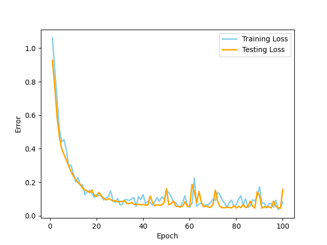

# Speedy MLP 

Speedy MLP offers a simple interface for rapidly prototyping and training a fully-connected multi-layer perceptron. All you need is a correctly formatted CSV and just a little know-how. Read on to know how.  

## Installation
Navigate to your desired location and perform the following steps:
1. `$ git clone https://github.com/jGaiser/Speedy-MLP.git`
2. `$ cd Speedy-MLP/ `
3. `$ make && make install`

## Usage
### Input Files
At this juncture, Speedy-MLP accepts a precisely formatted CSV file as input, one that adheres to the following rules:

	1. All but the last column must be numerical
	2. The last column must denote the classification

### Basic Usage
Now you're ready to do some machine-style learning. Two datasets have been provided as examples: the classic iris flower classification set, and a wine classification data set.

Let's train a simple MLP on the iris data set. 

`$ ./speedy_mlp -i data/iris/iris.data -n iris_model 4,8 ReLU 8,3  `

This operation will output the resulting classifier model file `iris_model.model`, and a png of the training plot `iris_model.png`. 

 

Your plot shouldn't be too different from the one pictured above. Hopefully, you'll see  a similar initial drop in training and testing errors before converging on a low average error, indicating good model performance. 

To better understand how to use Speedy-MLP,  let's return to our initial command. The only required flag is `-i`, which is used to indicate the input file. 
After the parameter flags, the user must specify the MLP architecture. 

An argument structured as `[x,y]` (where `x` and `y` are integers) indicates a linear transformation between a layer of `x` features to a layer of `y` features. 

At any point in the structure, any legal activation function from the <a href=https://pytorch.org/docs/stable/nn.html#non-linear-activations-weighted-sum-nonlinearity> torch.nn library</a>.

There are several constraints inherent to any neural network architecture that apply here:

	1. All but the last column must be numerical
	2. The last column denotes the classification

Of course, layers must be defined in a logical fashion, consistent with any neural network architecture: 

	1. The first parameter of the first transformation and last
	   parameter of the last transformation must be equal
	   to the number of features and classes, respectively
	   (The iris dataset has 4 unique features, and there are 3
	   different classes of iris). 
		  
	2. The second parameter of a transformation must agree with the
	   first parameter of the next transformation.
	   (e.g. [4,8 8,3] is valid [4,8 5,3] is not)

There are a handful of additional flags that may be used to adjust hyper-parameters and set output locations:

	-lr: learning rate (default: 1e-2)
	-bs: batch size (default: 8)
	-e:  epoch number (default: 100)
	-tf: testing fraction (default: 0.1)
	-i:  input file (no default)
	-n:  model name (default: 'mlp-model_[DATE,TIME]) 
	-o:  output location (default: current directory)
